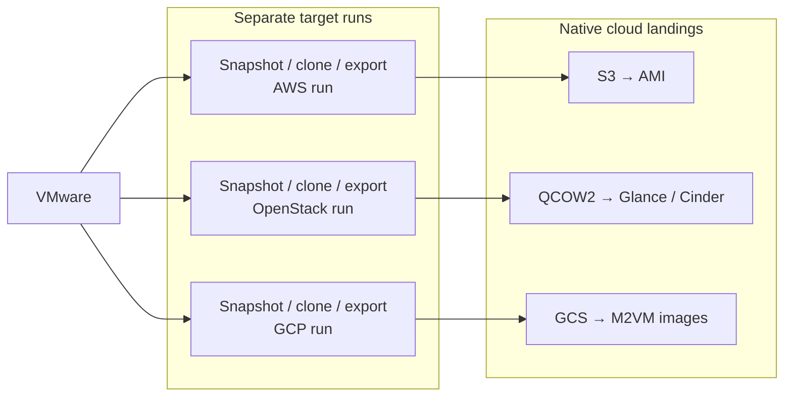

# Workflow

<!-- markdownlint-disable MD013 -->

Each target migration is a separate run that performs its own VMware snapshot,
clone, OVA export, and manifest generation. The target playbooks reuse the same
task implementation for those stages, then import the run's exported disks
using the selected cloud's native workflow and record the result in the
migration catalog. The export manifest is target-neutral and may include
ordered `source_mac_addresses` from vSphere for OpenStack launches that
preserve network identity.

The migration catalog records each completed target artifact and its provenance.
The launch playbooks select the newest completed migration for a VM unless an
artifact is supplied explicitly. Successful runs remove temporary VMware,
cloud-staging, and local artifacts. Failed OpenStack and GCP runs retain
resumable artifacts; failed AWS imports retain the staged OVA in S3 for a
follow-up import. Retained artifacts are deleted when
`discard_failed_artifacts=true` is supplied.

See the target playbooks in [README.md](../README.md#flow) for command examples
and the platform-specific requirements.
